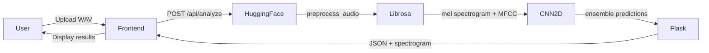

# CardioSonic
Author: lmaodedAk

A CNN-based cardiac audio classification system that detects heart 
abnormalities from PCG (phonocardiogram) recordings using deep learning.

**Live Demo:** https://frontend-eight-phi-68.vercel.app  
**Backend API:** https://akshat23456-cardiosonic-api.hf.space

---

## Overview

CardioSonic analyzes .wav audio recordings from digital stethoscopes 
and classifies them into three categories: Normal, Murmur, and Abnormal. 
The system uses a CNN2D ensemble model trained on mel spectrograms and 
MFCC features extracted from cardiac cycle audio.

---

## Tech Stack


**Frontend:** React + Vite — deployed on Vercel  
**Backend:** Flask + PyTorch — deployed on HuggingFace Spaces (Docker)  
**Model:** CNN2D Ensemble trained on PhysioNet PCG dataset  
**Audio Processing:** librosa (SR: 2000Hz, n_mels: 128, n_fft: 512)  

---

## Model Performance

| Metric | Score |
|--------|-------|
| Overall Accuracy | 70.2% |
| Normal Accuracy | 90.2% |
| Murmur Accuracy | 80.0% |
| Abnormal Accuracy | 31.8% |
| Weighted F1 | 0.699 |
| AUC-ROC | 0.85 |

**Dataset:** PhysioNet 2016 Challenge — Heart Sound Classification  
**Classes:** Normal, Murmur, Abnormal  
**Input:** WAV files (16-bit, mono, resampled to 2000Hz)  

---

## Project Structure
cardiosonic_ai/
├── backend/
│   ├── app.py
│   ├── Dockerfile
│   ├── requirements.txt
│   ├── models/
│   │   └── best_model.pt
│   └── src/
│       ├── preprocessing/
│       │   ├── preprocess.py
│       │   └── features.py
│       ├── training/
│       └── evaluation/
├── frontend/
│   ├── src/
│   │   └── App.jsx
│   ├── public/
│   ├── index.html
│   └── package.json
├── data/
│   ├── set_a/
│   └── set_b/
└── README.md

---

## Architecture


---

## Model Architecture

- **Type:** CNN2D Ensemble (5-fold cross validation)
- **Input branches:** Mel Spectrogram (128x47) + MFCC
- **Sample Rate:** 2000Hz
- **Feature extraction:** Log-Mel Spectrogram + MFCC
- **Training:** 5-fold ensemble, best weights saved per fold

---

## Local Setup

### Backend
```bash
cd backend
python -m venv venv
source venv/bin/activate
pip install -r requirements.txt
python app.py
```
Backend runs on http://localhost:7860

### Frontend
```bash
cd frontend
npm install
cp .env.example .env.local
# Set VITE_API_URL=http://localhost:7860
npm run dev
```
Frontend runs on http://localhost:5173

---

## API Reference

| Method | Endpoint | Description |
|--------|----------|-------------|
| POST | /api/analyze | Upload WAV, returns prediction + spectrogram |
| GET | /api/metrics | Returns model evaluation metrics |

**POST /api/analyze response:**
```json
{
  "predicted_class": "Normal",
  "confidence": 0.847,
  "probabilities": {
    "Abnormal": 0.082,
    "Murmur": 0.071,
    "Normal": 0.847
  },
  "spectrogram": "<base64 image string>"
}
```

---

## Deployment

| Service | Platform | URL |
|---------|----------|-----|
| Frontend | Vercel | https://frontend-eight-phi-68.vercel.app |
| Backend | HuggingFace Spaces | https://akshat23456-cardiosonic-api.hf.space |

---

## Limitations

- Abnormal class accuracy is 31.8% due to limited training samples
- Predictions below 55% confidence are flagged as uncertain
- Best results with digital stethoscope recordings (5-30 seconds)
- Phone microphone recordings may produce unreliable results

---

## License

MIT
