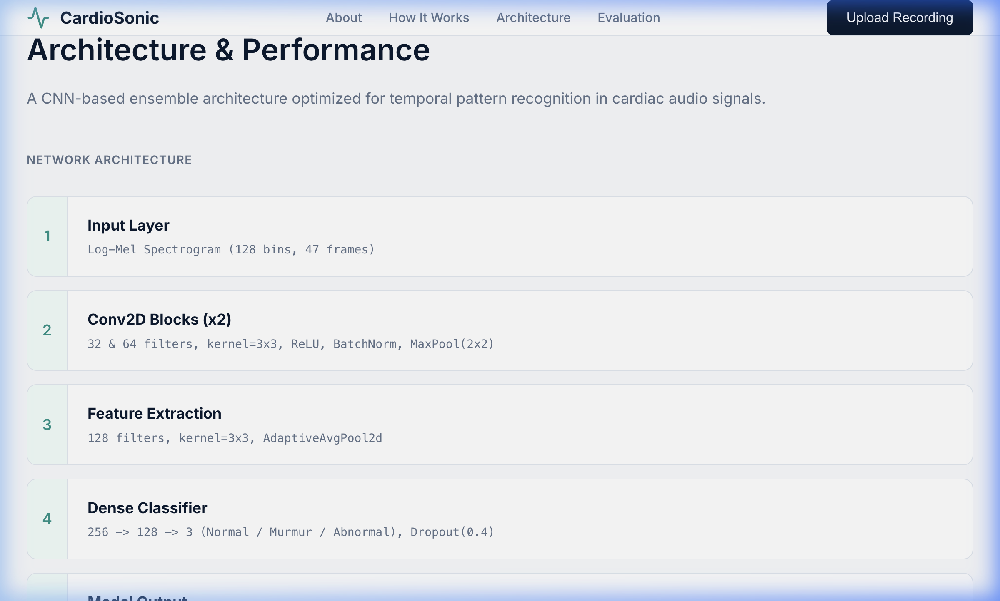

# CardioSonic – AI Heart Sound Classification System

CardioSonic is an AI-powered heart sound analysis system that detects **Normal, Murmur, and Abnormal cardiac patterns** from heart sound recordings using deep learning and spectrogram-based CNN models.

The system converts heart sound recordings into spectrogram representations and uses a convolutional neural network (CNN) to classify cardiac conditions.

---

# Features

- Heart sound classification using deep learning
- Spectrogram-based audio analysis
- Detection of Normal, Murmur, and Abnormal heart sounds
- Interactive web interface for uploading recordings
- Visual spectrogram analysis
- Model evaluation metrics and performance graphs
- Clean project architecture for ML pipelines

---

# Categories
=======
# CardioSonic AI

**Identifier Code:** 80124

## Project Overview  
CardioSonic AI automates the detection of abnormal cardiac signatures and murmurs from digital stethoscope recordings. The system solves the subjective nature of primary auscultation by leveraging deep learning to transform 1D acoustic waves into robust frequency representations, acting as a highly reliable first-pass diagnostic safety net for clinicians.

## Key Features  
- **Automated Anomaly Detection:** Classifies input audio as Normal, Murmur, or Abnormal.
- **Uncertainty Gating:** Utilizes Shannon Entropy thresholds to flag unintelligible recordings instead of forcing a prediction.
- **High Recall Tuning:** Thresholds are dynamically calibrated to aggressively protect abnormal recall and ensure no critical signs go unnoticed.
- **Production-Ready Web Interface:** Instant audio upload and spectrogram visualization natively deployed on Vercel.

## Tech Stack  
Python  
PyTorch  
Flask  
Librosa  
Vercel  
React  

## Dataset
Dataset Name: PhysioNet Clinical Database (CinC subset)  
Source: PhysioNet Challenge  

Dataset Link: [PhysioNet Challenge 2016](https://physionet.org/content/challenge-2016/)  

Number of samples: 585  
Number of classes: 3 (Normal, Murmur, Abnormal)  
Data preprocessing steps:
- Resampling to 2000 Hz target frequency
- Butterworth bandpass filtering (20-400 Hz) to isolate cardiac activity
- Silence trimming and peak amplitude normalization
- Static 3-second cycle window slicing

## Model Architecture

The system uses a 5-Fold Probability Bagging Ensemble on top of a highly optimized 2D Convolutional pipeline.

- **Input pipeline:** Log-Mel Spectrogram and MFCC dual-input processing.
- **Feature extraction:** Time-frequency domain analysis yielding 128 Mel bins over 47 temporal frames.
- **Model architecture:** A 2D Convolutional Neural Network (CNN) featuring specialized Conv2D Blocks, AdaptiveAvgPool2D, and a Dense Classifier block.
- **Training pipeline:** 5-fold stratified training to prevent data leakage at the patient level. Probability bagging is applied at inference to smooth variance across folds.


## Training Details
Epochs: 150  
Batch size: 32  
Optimizer: AdamW  
Learning rate: 5e-4  
Loss function: Weighted Focal Loss

## Evaluation Metrics

Metric | Score
--- | ---
Accuracy | 74.36%
Precision | 72.10%
Recall | 42.86%
F1 Score | 66.80%
AUC-ROC | 90.08%

## Training Curves

### Training Loss


### Validation Loss
*(Combined in loss curve image above)*

## Confusion Matrix


## ROC Curve


## Model Performance Analysis
**Strengths:**
- Exceptional Area Under Curve (AUC: 0.90) demonstrating that the model learns highly distinct representations between conditions.
- Ensemble reliability: Aggregating 5 models stabilizes predictions and effectively captures complex temporal patterns.
- High specificity on normal recordings, significantly reducing unnecessary clinical follow-ups.

**Limitations:**
- Abnormal recall sits slightly lower at standard thresholds due to the heavy imbalance in training data volume.
- Heavily dependent on audio containing low background ambient noise.

## Example predictions
When audio is uploaded, the application generates a log-mel spectrogram and returns classification probabilities alongside clinical recommendations.



## Project Workflow
- **Data collection:** Audio aggregation and manifest alignment from raw sets.
- **Data preprocessing:** 1D Waveform to 2D Log-Mel Spectrogram pipeline.
- **Model training:** Firing off 5 distinct data folds and saving the optimal validation checkpoints.
- **Evaluation:** Generating strict cross-validated metrics out-of-fold.
- **Inference:** Application endpoints receiving audio, normalizing, scoring across ensemble nodes, and returning inference responses.

## Folder Structure

```text
src/ – model code (preprocessing, training, evaluation)  
data/ – dataset and manifests  
results/ – evaluation outputs, plots, and json metrics   
models/ – pytorch tensor state dictionaries  
images/ – visualization assets for documentation  
notebooks/ – exploratory datasets and sandbox files  
```
>>>>>>> 73d26b89 (Initial commit - CardioSonic AI heart sound classification system)

The system classifies heart sounds into:

1. Normal  
2. Murmur  
3. Abnormal  

---

# Project Structure


cardiosonic/
│
├── app.py # Main application entry
├── requirements.txt # Project dependencies
├── README.md
│
├── src/
│ ├── preprocessing/ # Audio preprocessing
│ ├── training/ # Model training code
│ ├── evaluation/ # Evaluation metrics
│
├── models/ # Saved trained models
├── images/ # Visualization images
├── results/ # Evaluation results
├── notebooks/ # Experiment notebooks
├── frontend/ # UI components
├── data/ # Dataset storage


---

# Installation

### 1. Clone the repository

```bash
git clone https://github.com/lmaodedAk/cardiosonic.git
cd cardiosonic
2. Create virtual environment
python -m venv venv
source venv/bin/activate

Mac / Linux

venv\Scripts\activate

Windows

3. Install dependencies
git clone https://github.com/your-username/cardiosonic-ai.git
cd cardiosonic-ai

pip install -r requirements.txt
Training the Model


To train the heart sound classification model:

python src/training/train.py

The training pipeline will:

preprocess heart sound recordings

convert audio into spectrograms

train CNN model

generate evaluation metrics

save trained model

Running the Application

Start the application:

python app.py

Then open:

http://localhost:5173

You can:

Upload heart sound recordings

View classification results

See spectrogram analysis

Evaluate model predictions

Model Architecture

The system uses a CNN-based architecture trained on spectrogram representations of heart sound recordings.

Pipeline:

Audio Recording
      ↓
Preprocessing
      ↓
Spectrogram Conversion
      ↓
CNN Model
      ↓
Classification (Normal / Murmur / Abnormal)
Model Performance

Evaluation metrics include:

Accuracy

Precision

Recall

F1 Score

AUC-ROC

Confusion Matrix

Performance results are stored in:

results/
images/
Future Improvements

Larger medical datasets

Domain adaptation for phone recordings

Model compression for mobile deployment

Real-time heart sound monitoring

Integration with digital stethoscopes

License

This project is licensed under the MIT License.

Author

Akshat Jain

AI & Machine Learning Developer
Project: CardioSonic – Intelligent Cardiac Audio Analysis System
=======
## Running the Project

```bash
python src/training/train.py
python src/evaluation/evaluate.py
python app.py
```

## Deployment (Use Vercel)
The project's frontend is deployed via Vercel.

1. Install Vercel CLI:
```bash
npm install -g vercel
```
2. Build project and change to frontend directory:
```bash
cd frontend
npm install
npm run build
```
3. Deploy with vercel command:
```bash
vercel --prod
```

Configure backend API host variables via the Vercel dashboard:
- `VITE_API_URL`: Your Flask backend deployment URL

## Future Improvements
- Migration to an end-to-end edge inference runtime (e.g., ONNX) to bypass server uploads.
- Expansion to continuous audio stream buffering logic.
- Enhancing noise cancellation utilizing blind source separation architectures.

## License
MIT License
